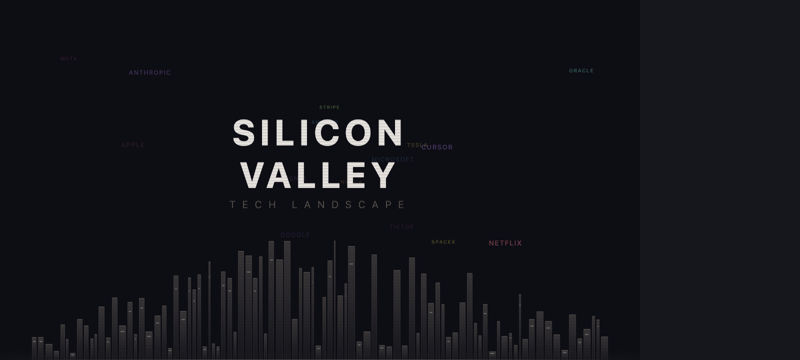
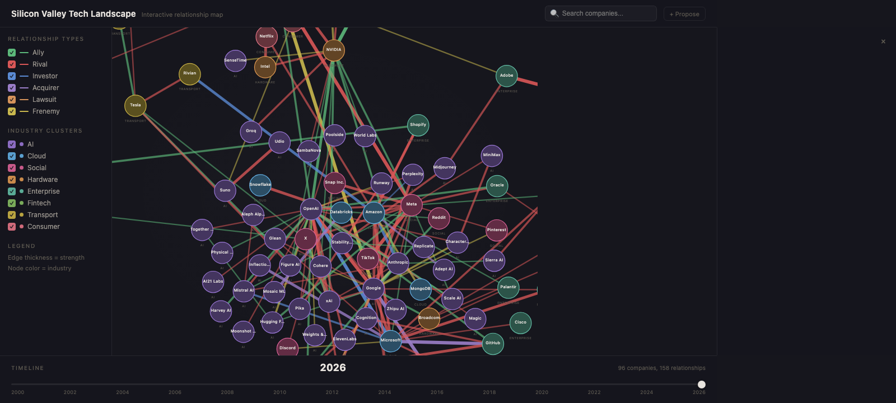

<div align="center">

# Tech Industry Landscape

**Who's allied with whom. Who's at war. And why.**

An interactive map of relationships across the global tech industry — rivalries, alliances, lawsuits, investments, and frenemies — visualized as a force-directed graph you can explore through time.

**[landscape.guzus.xyz](https://landscape.guzus.xyz)**





</div>

---

### What you can do

- **Drag the timeline** from 2000 to 2026 and watch the AI explosion happen in real time
- **Click any edge** to read the full story — Google vs Oracle's decade-long Supreme Court battle, Apple's ATT wiping $10B from Meta's revenue, Microsoft's $13B bet on OpenAI
- **Hover any company** for valuation, CEO, HQ, and a one-liner
- **Node size = valuation** — Apple ($3.5T) dwarfs startups at a glance
- **Search** for a company and see its entire relationship web light up
- **Filter** by relationship type (show only lawsuits, only investments) or industry cluster
- **Share** your exact view state via URL — year, filters, search query all encoded in the hash

### The data

| | Count |
|---|---|
| Companies | 97 |
| Relationships | 170 |
| Relationship types | 6 (ally, rival, investor, acquirer, lawsuit, frenemy) |
| Industry clusters | 8 (AI, Cloud, Social, Hardware, Enterprise, Fintech, Transport, Consumer) |
| Timeline span | 2000 - 2026 |

Companies span Big Tech (Google, Apple, Microsoft, Amazon, Meta), AI labs (OpenAI, Anthropic, DeepSeek, Mistral), AI startups (Cursor, Perplexity, Figure AI), chipmakers (NVIDIA, TSMC, Cerebras, Groq), Chinese tech (Baidu, Zhipu, Moonshot, MiniMax, SenseTime), enterprise (Salesforce, ServiceNow, Palantir), fintech (Stripe, PayPal, Coinbase), and more.

### Contribute

See a missing company or wrong relationship? **[Submit a proposal](https://github.com/guzus/tech-landscape/issues/new/choose)** — there are templates for adding companies, relationships, and fixing data.

Or just edit `data.js` directly and open a PR.

### Run locally

```bash
npx serve .
```

> Needs a local server — opening `index.html` as a file won't work because of separate `.js` files.

### Tech

D3.js v7. Vanilla HTML/CSS/JS. No build step. Hosted on Netlify.

### License

MIT
